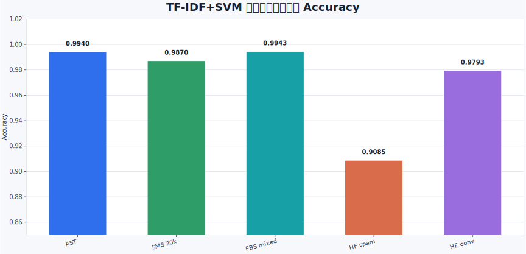

# 实验报告：TF-IDF+SVM 与课件版 Rule-free CSN

## 任务目标

本项目完成中文垃圾文本检测，并保留两条传统机器学习路线：

1. **强 baseline：TF-IDF+SVM**
2. **课件版非人工词表 CSN：Rule-free CSN+LR**

两个版本都不使用人工敏感词表、人工变体词表或风险词硬匹配。区别在于：TF-IDF+SVM 直接使用稀疏字符 n-gram 特征；Rule-free CSN+LR 按课件流程构建字符相似性网络，生成字符嵌入和句子嵌入，再用逻辑回归分类。

## 数据与划分

课程数据位于 `data/raw/dataset.txt`。实验脚本可直接读取该原始文件。

| 项目 | 数量 |
|---|---:|
| 总样本 | 16007 |
| 垃圾文本 | 11007 |
| 正常文本 | 5000 |
| 测试集样本 | 4803 |
| 测试集垃圾文本 | 3303 |
| 测试集正常文本 | 1500 |

划分方式为 `train_test_split(test_size=0.3, random_state=42, stratify=label)`，即 70% 训练、30% 测试，并保持类别比例。

## 模型一：TF-IDF+SVM

该版本是项目主 baseline：

1. 文本清洗：统一小写，去除标点和特殊符号，保留中文、英文、数字和空白。
2. 字符切分：中文逐字切分，连续英文/数字作为一个 token。
3. 特征提取：字符级 `TF-IDF`，`1-3gram`。
4. 分类器：`Linear SVM`，使用 `class_weight="balanced"` 处理类别不均衡。

该方法完全依赖训练数据中的统计特征，不写人工垃圾词表。

## 模型二：Rule-free CSN+LR

该版本按课件第三部分的 CSN 思路实现：

1. **字形/字音编码**：对每个字符生成通用编码。字音部分使用拼音、声母、韵母和声调；字形部分不写人工偏旁/变体表，而使用 Unicode 邻域作为粗粒度自动字形代理。
2. **构建字符相似性网络**：根据字符编码计算相似度，保留超过阈值的相似字符邻居。
3. **字符嵌入学习**：从训练语料中学习字符级语料分布嵌入。
4. **CSN 字符嵌入**：用相似字符邻居对原始字符嵌入进行加权聚合。
5. **句子嵌入生成**：对文本中的 CSN 字符嵌入做注意力式池化，得到固定长度句向量。
6. **分类模型**：使用 `Logistic Regression` 分类。

因此，Rule-free CSN+LR 不再使用 `TF-IDF + Linear SVM` 作为主体，而是“字符相似性网络 + 句子嵌入 + 逻辑回归”。

## AST 评测结果

| 方法 | Accuracy | Spam F1 |
|---|---:|---:|
| Majority baseline | 0.6877 | 0.8150 |
| TF-IDF+LR baseline | 0.9904 | 0.9930 |
| TF-IDF+SVM | 0.9940 | 0.9956 |
| Rule-free CSN+LR | 0.9715 | 0.9791 |


## 结果分析

TF-IDF+SVM 在同源随机划分上表现最好，Spam F1 达到 `0.9956`。这是因为字符 n-gram 对垃圾文本中的网址、联系方式、退订、异常字符和模板表达非常敏感，适合作为强 baseline。

Rule-free CSN+LR 的 Spam F1 为 `0.9791`，低于 TF-IDF+SVM，但它更贴近课件要求：先通过字符相似性网络得到字符嵌入，再生成句子嵌入并接逻辑回归。它没有直接使用高维稀疏 n-gram 模板特征，因此对具体 URL、数字串、格式化联系方式的记忆能力弱一些。

结论上，**TF-IDF+SVM 适合作为最终强 baseline 展示**；**Rule-free CSN+LR 适合作为课程指定方法的工程实现展示**。二者放在一起，可以说明传统 n-gram baseline 很强，也可以说明课件中的 CSN 方法已经被单独实现出来。

## TF-IDF+SVM 多数据集评测

为验证强 baseline 在不同来源数据上的表现，我们将同一个 `TF-IDF+SVM` 流程分别跑在多个真实数据集上。这里采用的是各数据集内部的 `70%/30%` 分层随机划分，因此结果反映的是“同源数据内评测”，不是跨数据集迁移评测。

| 数据集 | 总样本 | 测试样本 | Accuracy |
|---|---:|---:|---:|
| AST course | 16007 | 4803 | 0.9940 |
| Chinese SMS 20k | 20000 | 6000 | 0.9870 |
| FBS mixed | 10000 | 3000 | 0.9943 |
| HF chinese-spam | 9941 | 2983 | 0.9085 |
| HF conversation-spam | 7731 | 2320 | 0.9793 |



从图中可以看到，TF-IDF+SVM 在 AST、FBS mixed 和 Chinese SMS 20k 上表现很高，在 HF conversation-spam 上也较稳定；但在 HF chinese-spam 上 Accuracy 降到 `0.9085`。这说明强 baseline 对同源模板型垃圾文本很有效，但不同来源数据的表达风格、标签标准和文本长度变化仍会影响模型表现。

## 运行命令

```bash
python -m src.tfidf_svm_baseline.experiment \
  --data data/raw/dataset.txt

python -m src.rule_free_csn.experiment \
  --data data/raw/dataset.txt

python -m src.tfidf_svm_baseline.generate_figures
```
