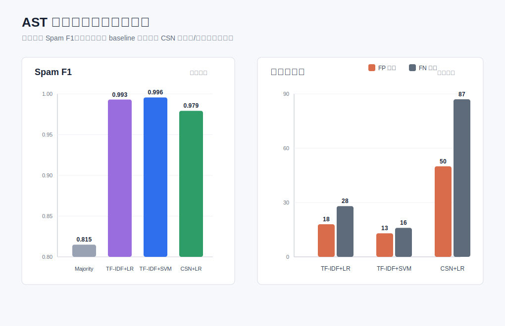

# 实验报告：v1 字符级 SVM 垃圾文本检测

## 任务目标

本项目完成中文垃圾文本检测。当前最终模型只保留 v1，避免人工敏感词表、人工变体词表、风险词硬匹配等容易被认为是作弊的策略。

## 模型原理

v1 使用传统机器学习流程：

1. 文本清洗：统一小写，去除标点和特殊符号，保留中文、英文、数字和空白。
2. 字符切分：中文逐字切分，连续英文/数字作为一个 token。
3. 特征提取：`TF-IDF`，字符 `1-3gram`。
4. 分类器：`Linear SVM`，使用 `class_weight="balanced"` 处理类别不均衡。

该方法不依赖人工垃圾词表，而是从训练数据中自动学习字符 n-gram 与垃圾文本标签之间的统计关系。

## 数据与划分

课程数据位于 `data/raw/dataset.txt`，清洗后得到 `data/processed/ast_dataset.tsv`。

| 项目 | 数量 |
|---|---:|
| 清洗后总样本 | 15923 |
| 垃圾文本 | 11000 |
| 正常文本 | 4923 |
| 测试集样本 | 4777 |
| 测试集垃圾文本 | 3300 |
| 测试集正常文本 | 1477 |

划分方式为 `train_test_split(test_size=0.3, random_state=42, stratify=label)`，即 70% 训练、30% 测试，并保持类别比例。

## 评测结果

| 方法 | Accuracy | Precision | Recall | Spam F1 | FP | FN |
|---|---:|---:|---:|---:|---:|---:|
| v0 Logistic Regression baseline | 0.9900 | 0.9945 | 0.9909 | 0.9927 | 18 | 30 |
| v1 Char TF-IDF + Linear SVM | 0.9939 | 0.9967 | 0.9945 | 0.9956 | 11 | 18 |
| v4 高阈值对照 | 0.9860 | 0.9988 | 0.9809 | 0.9898 | 4 | 63 |
| v5 融合对照 | 0.9937 | 0.9946 | 0.9964 | 0.9955 | 18 | 12 |

## 结论

v1 在不使用硬词表的前提下取得了很强的整体表现，Spam F1 达到 `0.9956`。相比 v0，v1 同时降低误报和漏检；相比 v4，v1 避免了高阈值带来的明显漏检；相比 v5，v1 指标几乎相同但结构更简单、更容易解释。

因此最终选择 v1 作为项目主模型。
