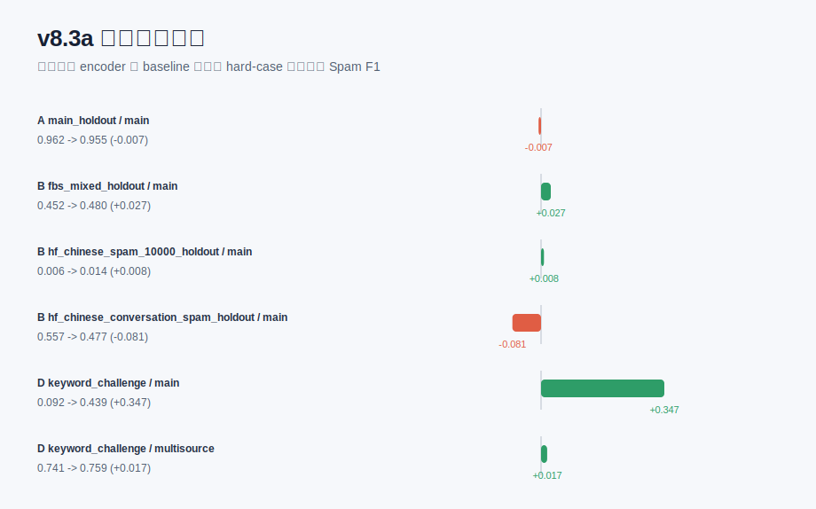

# v8.3a 轻量自动 Hard-case 增强

本实验不使用人工垃圾词表，从训练 split 自动挖掘 spam 相关短 n-gram，并基于分隔符、重复字符和训练语料中的同音字符生成 hard positive 样本。编码器和分类器仍沿用 v8：冻结语义编码器 + Logistic Regression。

## Baseline vs AutoAug

| protocol_id | dataset | scope | baseline_f1 | autoaug_f1 | f1_delta | baseline_recall | autoaug_recall | fn_delta |
| --- | --- | --- | --- | --- | --- | --- | --- | --- |
| A | main_holdout | main | 0.9619 | 0.9548 | -0.0071 | 0.9619 | 0.9454 | 10.0000 |
| A | main_holdout | multisource | 0.8716 | 0.8721 | 0.0005 | 0.9553 | 0.9255 | 18.0000 |
| B | fbs_mixed_holdout | main | 0.4524 | 0.4799 | 0.0275 | 0.2934 | 0.3169 | -82.0000 |
| B | hf_chinese_spam_10000_holdout | main | 0.0063 | 0.0145 | 0.0082 | 0.0032 | 0.0075 | -15.0000 |
| B | hf_chinese_conversation_spam_holdout | main | 0.5575 | 0.4767 | -0.0808 | 0.3895 | 0.3227 | 144.0000 |
| C | fbs_mixed_holdout | multisource | 0.9707 | 0.9683 | -0.0024 | 0.9643 | 0.9557 | 30.0000 |
| C | hf_chinese_spam_10000_holdout | multisource | 0.8465 | 0.8406 | -0.0059 | 0.8111 | 0.7973 | 48.0000 |
| C | hf_chinese_conversation_spam_holdout | multisource | 0.8998 | 0.8898 | -0.0100 | 0.9025 | 0.8825 | 43.0000 |
| D | keyword_challenge | main | 0.0919 | 0.4393 | 0.3474 | 0.0481 | 0.2815 | -63.0000 |
| D | keyword_challenge | multisource | 0.7413 | 0.7586 | 0.0174 | 0.5889 | 0.6111 | -6.0000 |

## 完整指标

| protocol_id | dataset | model_version | training_scope | threshold | accuracy | precision_spam | recall_spam | f1_spam | false_positive | false_negative |
| --- | --- | --- | --- | --- | --- | --- | --- | --- | --- | --- |
| A | main_holdout | v8_semantic_main | main_only | 0.7500 | 0.9923 | 0.9619 | 0.9619 | 0.9619 | 23.0000 | 23.0000 |
| A | main_holdout | v8_semantic_autoaug_main | main_only_autoaug | 0.8000 | 0.9910 | 0.9645 | 0.9454 | 0.9548 | 21.0000 | 33.0000 |
| A | main_holdout | v8_semantic_multisource | main_plus_external_adapt | 0.6500 | 0.9717 | 0.8014 | 0.9553 | 0.8716 | 143.0000 | 27.0000 |
| A | main_holdout | v8_semantic_autoaug_multisource | main_plus_external_adapt_autoaug | 0.7000 | 0.9727 | 0.8245 | 0.9255 | 0.8721 | 119.0000 | 45.0000 |
| B | fbs_mixed_holdout | v8_semantic_main | main_only | 0.7500 | 0.6449 | 0.9875 | 0.2934 | 0.4524 | 13.0000 | 2473.0000 |
| B | fbs_mixed_holdout | v8_semantic_autoaug_main | main_only_autoaug | 0.8000 | 0.6566 | 0.9884 | 0.3169 | 0.4799 | 13.0000 | 2391.0000 |
| C | fbs_mixed_holdout | v8_semantic_multisource | main_plus_external_adapt | 0.6500 | 0.9709 | 0.9771 | 0.9643 | 0.9707 | 79.0000 | 125.0000 |
| C | fbs_mixed_holdout | v8_semantic_autoaug_multisource | main_plus_external_adapt_autoaug | 0.7000 | 0.9687 | 0.9812 | 0.9557 | 0.9683 | 64.0000 | 155.0000 |
| B | hf_chinese_spam_10000_holdout | v8_semantic_main | main_only | 0.7500 | 0.4988 | 0.5000 | 0.0032 | 0.0063 | 11.0000 | 3477.0000 |
| B | hf_chinese_spam_10000_holdout | v8_semantic_autoaug_main | main_only_autoaug | 0.8000 | 0.4906 | 0.2385 | 0.0075 | 0.0145 | 83.0000 | 3462.0000 |
| C | hf_chinese_spam_10000_holdout | v8_semantic_multisource | main_plus_external_adapt | 0.6500 | 0.8526 | 0.8852 | 0.8111 | 0.8465 | 367.0000 | 659.0000 |
| C | hf_chinese_spam_10000_holdout | v8_semantic_autoaug_multisource | main_plus_external_adapt_autoaug | 0.7000 | 0.8484 | 0.8888 | 0.7973 | 0.8406 | 348.0000 | 707.0000 |
| B | hf_chinese_conversation_spam_holdout | v8_semantic_main | main_only | 0.7500 | 0.7539 | 0.9801 | 0.3895 | 0.5575 | 17.0000 | 1315.0000 |
| B | hf_chinese_conversation_spam_holdout | v8_semantic_autoaug_main | main_only_autoaug | 0.8000 | 0.7180 | 0.9121 | 0.3227 | 0.4767 | 67.0000 | 1459.0000 |
| C | hf_chinese_conversation_spam_holdout | v8_semantic_multisource | main_plus_external_adapt | 0.6500 | 0.9200 | 0.8971 | 0.9025 | 0.8998 | 223.0000 | 210.0000 |
| C | hf_chinese_conversation_spam_holdout | v8_semantic_autoaug_multisource | main_plus_external_adapt_autoaug | 0.7000 | 0.9130 | 0.8971 | 0.8825 | 0.8898 | 218.0000 | 253.0000 |
| D | adversarial | v8_semantic_main | main_only | 0.7500 | 1.0000 | 1.0000 | 1.0000 | 1.0000 | 0.0000 | 0.0000 |
| D | adversarial | v8_semantic_autoaug_main | main_only_autoaug | 0.8000 | 0.9847 | 1.0000 | 0.9847 | 0.9923 | 0.0000 | 2.0000 |
| D | adversarial | v8_semantic_multisource | main_plus_external_adapt | 0.6500 | 0.9924 | 1.0000 | 0.9924 | 0.9962 | 0.0000 | 1.0000 |
| D | adversarial | v8_semantic_autoaug_multisource | main_plus_external_adapt_autoaug | 0.7000 | 0.9695 | 1.0000 | 0.9695 | 0.9845 | 0.0000 | 4.0000 |
| D | keyword_challenge | v8_semantic_main | main_only | 0.7500 | 0.0481 | 1.0000 | 0.0481 | 0.0919 | 0.0000 | 257.0000 |
| D | keyword_challenge | v8_semantic_autoaug_main | main_only_autoaug | 0.8000 | 0.2815 | 1.0000 | 0.2815 | 0.4393 | 0.0000 | 194.0000 |
| D | keyword_challenge | v8_semantic_multisource | main_plus_external_adapt | 0.6500 | 0.5889 | 1.0000 | 0.5889 | 0.7413 | 0.0000 | 111.0000 |
| D | keyword_challenge | v8_semantic_autoaug_multisource | main_plus_external_adapt_autoaug | 0.7000 | 0.6111 | 1.0000 | 0.6111 | 0.7586 | 0.0000 | 105.0000 |

## 自动挖掘片段示例

| scope | term | spam_df | normal_df | hard_df | score |
| --- | --- | --- | --- | --- | --- |
| main_fit | 优惠 | 171 | 1 | 21 | 563.1079 |
| main_fit | 您好 | 147 | 2 | 36 | 382.4286 |
| main_fit | 尊敬 | 64 | 0 | 8 | 347.5272 |
| main_fit | 尊敬的 | 64 | 0 | 8 | 347.5272 |
| main_fit | 敬的 | 64 | 0 | 8 | 347.5272 |
| main_fit | x折 | 144 | 2 | 23 | 326.2257 |
| main_fit | 新老 | 52 | 0 | 11 | 311.9162 |
| main_fit | 三八 | 80 | 1 | 24 | 300.1804 |
| main_fit | 女节 | 42 | 0 | 10 | 250.1284 |
| main_fit | 送xx | 48 | 0 | 6 | 244.4473 |
| main_fit | 好,我是 | 39 | 0 | 11 | 243.7732 |
| main_fit | 满x | 76 | 1 | 15 | 241.9157 |
| main_fit | 妇女节 | 40 | 0 | 10 | 239.8414 |
| main_fit | 元宵 | 73 | 1 | 15 | 233.4091 |
| main_fit | 满xx | 73 | 1 | 14 | 228.3442 |
| main_fit | 询x | 30 | 0 | 13 | 215.6988 |
| main_fit | 询xx | 30 | 0 | 13 | 215.6988 |
| main_fit | 询xxx | 30 | 0 | 13 | 215.6988 |
| main_fit | 满xxx | 68 | 1 | 14 | 214.3138 |
| main_fit | 八节 | 36 | 0 | 9 | 210.5753 |

## 自动生成样本示例

| scope | source_term | text | label |
| --- | --- | --- | --- |
| main_fit | 优惠 | 优惠惠 | 1 |
| main_fit | 优惠 | 优会 | 1 |
| main_fit | 优惠 | 优优惠 | 1 |
| main_fit | 优惠 | 优惠 | 1 |
| main_fit | 优惠 | 游惠 | 1 |
| main_fit | 优惠 | 优 惠 | 1 |
| main_fit | 优惠 | 优回 | 1 |
| main_fit | 优惠 | 有惠 | 1 |
| main_fit | 您好 | 您好 | 1 |
| main_fit | 您好 | 您号 | 1 |
| main_fit | 您好 | 您 好 | 1 |
| main_fit | 您好 | 您您好 | 1 |
| main_fit | 您好 | 您好好 | 1 |
| main_fit | 您好 | 您豪 | 1 |
| main_fit | 尊敬 | 尊京 | 1 |
| main_fit | 尊敬 | 樽敬 | 1 |
| main_fit | 尊敬 | 尊敬敬 | 1 |
| main_fit | 尊敬 | 遵敬 | 1 |
| main_fit | 尊敬 | 尊经 | 1 |
| main_fit | 尊敬 | 尊尊敬 | 1 |

## 结论口径

- 若 keyword challenge 提升且主数据不明显下降，说明自动 hard-case 增强有效。
- 若主数据或外部数据明显退化，需要降低 `--max-augmented` 或提高 `--min-spam-df`。
- 本实验仍不等价于人工 CSN 词表；所有片段来自训练 split 的统计挖掘。
