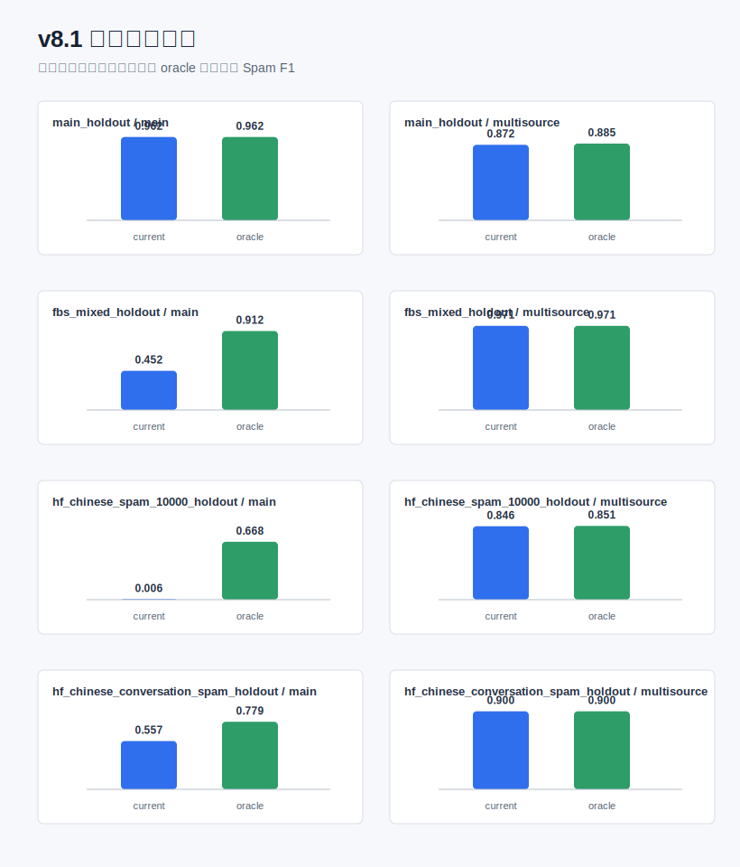
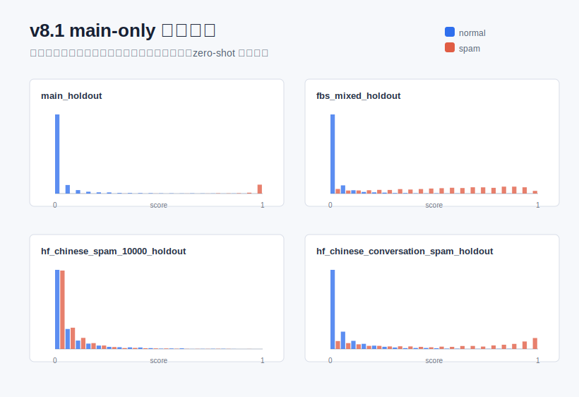

# v8.1 评测诊断与校准

本实验在 v8.0 冻结语义编码器结果上增加校准诊断：比较当前阈值与每个评测集 oracle 阈值，判断问题来自阈值校准还是语义表示本身。

## 诊断结论

- FBS zero-shot 的 PR-AUC 较高，说明排序能力存在，主要问题是主数据阈值迁移后过于保守。
- `hf_chinese_spam_10000` zero-shot 的 PR-AUC 接近随机，说明单靠阈值无法修复，需要换编码器或做监督适配。
- 多来源适配后的 v8 表现明显提升，说明语义模型需要少量目标域标注来校准边界。
- keyword challenge 仍是 v8.0 的短板，后续应做自动 hard-case 增强或监督微调。

## 核心表

| protocol_id | dataset | model_version | threshold_current | threshold_oracle | current_f1_spam | oracle_f1_spam | oracle_f1_gain | pr_auc | diagnosis |
| --- | --- | --- | --- | --- | --- | --- | --- | --- | --- |
| A | main_holdout | v8_semantic_main | 0.7500 | 0.7500 | 0.9619 | 0.9619 | 0.0000 | 0.9900 | healthy under current threshold |
| A | main_holdout | v8_semantic_multisource | 0.6500 | 0.8000 | 0.8716 | 0.8852 | 0.0136 | 0.9531 | mixed issue: try encoder comparison plus calibration |
| B | fbs_mixed_holdout | v8_semantic_main | 0.7500 | 0.1000 | 0.4524 | 0.9119 | 0.4595 | 0.9627 | calibration issue: score ranking is useful but threshold is too conservative |
| C | fbs_mixed_holdout | v8_semantic_multisource | 0.6500 | 0.5500 | 0.9707 | 0.9711 | 0.0004 | 0.9941 | healthy under current threshold |
| B | hf_chinese_spam_10000_holdout | v8_semantic_main | 0.7500 | 0.0000 | 0.0063 | 0.6678 | 0.6615 | 0.4950 | representation/domain mismatch: oracle threshold is degenerate; calibration alone is insufficient |
| C | hf_chinese_spam_10000_holdout | v8_semantic_multisource | 0.6500 | 0.5500 | 0.8465 | 0.8506 | 0.0041 | 0.9250 | mixed issue: try encoder comparison plus calibration |
| B | hf_chinese_conversation_spam_holdout | v8_semantic_main | 0.7500 | 0.2000 | 0.5575 | 0.7788 | 0.2213 | 0.8837 | calibration issue: score ranking is useful but threshold is too conservative |
| C | hf_chinese_conversation_spam_holdout | v8_semantic_multisource | 0.6500 | 0.6500 | 0.8998 | 0.8998 | 0.0000 | 0.9658 | mixed issue: try encoder comparison plus calibration |
| D | adversarial | v8_semantic_main | 0.7500 | 0.7500 | 1.0000 | 1.0000 | 0.0000 |  | spam-only challenge: use as threshold sensitivity check |
| D | adversarial | v8_semantic_multisource | 0.6500 | 0.4500 | 0.9962 | 1.0000 | 0.0038 |  | spam-only challenge: use as threshold sensitivity check |
| D | keyword_challenge | v8_semantic_main | 0.7500 | 0.0000 | 0.0919 | 1.0000 | 0.9081 |  | spam-only challenge: use as threshold sensitivity check |
| D | keyword_challenge | v8_semantic_multisource | 0.6500 | 0.0000 | 0.7413 | 1.0000 | 0.2587 |  | spam-only challenge: use as threshold sensitivity check |

## 输出文件

- `docs/experiments/semantic_v8/semantic_v8_calibration_diagnostics.md`：本页说明和核心诊断表
- `docs/experiments/semantic_v8/semantic_v8_threshold_grid.csv`：所有阈值扫描结果
- `docs/experiments/semantic_v8/semantic_v8_score_samples.csv`：逐样本分数、当前预测和错误类型
- `docs/experiments/semantic_v8/semantic_v8_pr_curve.csv`：PR 曲线采样点
- `docs/figures/semantic_v8/semantic_v8_threshold_gain.svg`：当前阈值 vs oracle 阈值 F1 对比图
- `docs/figures/semantic_v8/semantic_v8_score_distribution.svg`：main-only 分数分布图

## 下一步

v8.2 应优先做编码器对比。对于 FBS 和 conversation 数据集，可同步尝试无目标域标签的阈值校准；对于 `hf_chinese_spam_10000`，需要优先解决语义表示分不开的问题。
