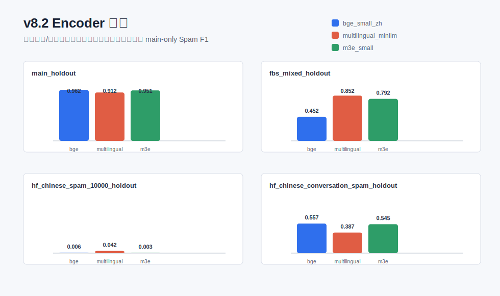

# v8.2 Encoder 对比

本实验固定 v8 的训练方式和 A/B/C/D 评测协议，仅替换冻结语义编码器，比较不同 encoder 对主数据集、外部 zero-shot、外部少量适配和 challenge 数据的影响。

## 每个协议/数据集的最优 Encoder

| protocol_id | dataset | model_version | encoder_name | accuracy | precision_spam | recall_spam | f1_spam | pr_auc | false_negative |
| --- | --- | --- | --- | --- | --- | --- | --- | --- | --- |
| A | main_holdout | v8_semantic_main | bge_small_zh | 0.9923 | 0.9619 | 0.9619 | 0.9619 | 0.9900 | 23.0000 |
| A | main_holdout | v8_semantic_multisource | bge_small_zh | 0.9717 | 0.8014 | 0.9553 | 0.8716 | 0.9531 | 27.0000 |
| B | fbs_mixed_holdout | v8_semantic_main | multilingual_minilm | 0.8700 | 0.9905 | 0.7471 | 0.8518 | 0.9816 | 885.0000 |
| B | hf_chinese_conversation_spam_holdout | v8_semantic_main | bge_small_zh | 0.7539 | 0.9801 | 0.3895 | 0.5575 | 0.8837 | 1315.0000 |
| B | hf_chinese_spam_10000_holdout | v8_semantic_main | multilingual_minilm | 0.4985 | 0.4935 | 0.0218 | 0.0417 | 0.5080 | 3412.0000 |
| C | fbs_mixed_holdout | v8_semantic_multisource | bge_small_zh | 0.9709 | 0.9771 | 0.9643 | 0.9707 | 0.9941 | 125.0000 |
| C | hf_chinese_conversation_spam_holdout | v8_semantic_multisource | bge_small_zh | 0.9200 | 0.8971 | 0.9025 | 0.8998 | 0.9658 | 210.0000 |
| C | hf_chinese_spam_10000_holdout | v8_semantic_multisource | m3e_small | 0.8557 | 0.8805 | 0.8240 | 0.8513 | 0.9291 | 614.0000 |
| D | adversarial | v8_semantic_main | bge_small_zh | 1.0000 | 1.0000 | 1.0000 | 1.0000 |  | 0.0000 |
| D | adversarial | v8_semantic_multisource | bge_small_zh | 0.9924 | 1.0000 | 0.9924 | 0.9962 |  | 1.0000 |
| D | keyword_challenge | v8_semantic_main | multilingual_minilm | 0.1074 | 1.0000 | 0.1074 | 0.1940 |  | 241.0000 |
| D | keyword_challenge | v8_semantic_multisource | bge_small_zh | 0.5889 | 1.0000 | 0.5889 | 0.7413 |  | 111.0000 |

## 完整对比结果

| protocol_id | dataset | model_version | encoder_name | training_scope | threshold | accuracy | precision_spam | recall_spam | f1_spam | pr_auc | false_positive | false_negative |
| --- | --- | --- | --- | --- | --- | --- | --- | --- | --- | --- | --- | --- |
| A | main_holdout | v8_semantic_main | bge_small_zh | main_only | 0.7500 | 0.9923 | 0.9619 | 0.9619 | 0.9619 | 0.9900 | 23.0000 | 23.0000 |
| A | main_holdout | v8_semantic_multisource | bge_small_zh | main_plus_external_adapt | 0.6500 | 0.9717 | 0.8014 | 0.9553 | 0.8716 | 0.9531 | 143.0000 | 27.0000 |
| B | fbs_mixed_holdout | v8_semantic_main | bge_small_zh | main_only | 0.7500 | 0.6449 | 0.9875 | 0.2934 | 0.4524 | 0.9627 | 13.0000 | 2473.0000 |
| C | fbs_mixed_holdout | v8_semantic_multisource | bge_small_zh | main_plus_external_adapt | 0.6500 | 0.9709 | 0.9771 | 0.9643 | 0.9707 | 0.9941 | 79.0000 | 125.0000 |
| B | hf_chinese_spam_10000_holdout | v8_semantic_main | bge_small_zh | main_only | 0.7500 | 0.4988 | 0.5000 | 0.0032 | 0.0063 | 0.4950 | 11.0000 | 3477.0000 |
| C | hf_chinese_spam_10000_holdout | v8_semantic_multisource | bge_small_zh | main_plus_external_adapt | 0.6500 | 0.8526 | 0.8852 | 0.8111 | 0.8465 | 0.9250 | 367.0000 | 659.0000 |
| B | hf_chinese_conversation_spam_holdout | v8_semantic_main | bge_small_zh | main_only | 0.7500 | 0.7539 | 0.9801 | 0.3895 | 0.5575 | 0.8837 | 17.0000 | 1315.0000 |
| C | hf_chinese_conversation_spam_holdout | v8_semantic_multisource | bge_small_zh | main_plus_external_adapt | 0.6500 | 0.9200 | 0.8971 | 0.9025 | 0.8998 | 0.9658 | 223.0000 | 210.0000 |
| D | adversarial | v8_semantic_main | bge_small_zh | main_only | 0.7500 | 1.0000 | 1.0000 | 1.0000 | 1.0000 |  | 0.0000 | 0.0000 |
| D | adversarial | v8_semantic_multisource | bge_small_zh | main_plus_external_adapt | 0.6500 | 0.9924 | 1.0000 | 0.9924 | 0.9962 |  | 0.0000 | 1.0000 |
| D | keyword_challenge | v8_semantic_main | bge_small_zh | main_only | 0.7500 | 0.0481 | 1.0000 | 0.0481 | 0.0919 |  | 0.0000 | 257.0000 |
| D | keyword_challenge | v8_semantic_multisource | bge_small_zh | main_plus_external_adapt | 0.6500 | 0.5889 | 1.0000 | 0.5889 | 0.7413 |  | 0.0000 | 111.0000 |
| A | main_holdout | v8_semantic_main | multilingual_minilm | main_only | 0.7500 | 0.9822 | 0.9094 | 0.9139 | 0.9116 | 0.9694 | 55.0000 | 52.0000 |
| A | main_holdout | v8_semantic_multisource | multilingual_minilm | main_plus_external_adapt | 0.6500 | 0.9622 | 0.7629 | 0.9056 | 0.8282 | 0.9202 | 170.0000 | 57.0000 |
| B | fbs_mixed_holdout | v8_semantic_main | multilingual_minilm | main_only | 0.7500 | 0.8700 | 0.9905 | 0.7471 | 0.8518 | 0.9816 | 25.0000 | 885.0000 |
| C | fbs_mixed_holdout | v8_semantic_multisource | multilingual_minilm | main_plus_external_adapt | 0.6500 | 0.9674 | 0.9731 | 0.9614 | 0.9672 | 0.9949 | 93.0000 | 135.0000 |
| B | hf_chinese_spam_10000_holdout | v8_semantic_main | multilingual_minilm | main_only | 0.7500 | 0.4985 | 0.4935 | 0.0218 | 0.0417 | 0.5080 | 78.0000 | 3412.0000 |
| C | hf_chinese_spam_10000_holdout | v8_semantic_multisource | multilingual_minilm | main_plus_external_adapt | 0.6500 | 0.8409 | 0.8710 | 0.8013 | 0.8347 | 0.9210 | 414.0000 | 693.0000 |
| B | hf_chinese_conversation_spam_holdout | v8_semantic_main | multilingual_minilm | main_only | 0.7500 | 0.6918 | 0.9278 | 0.2447 | 0.3872 | 0.7894 | 41.0000 | 1627.0000 |
| C | hf_chinese_conversation_spam_holdout | v8_semantic_multisource | multilingual_minilm | main_plus_external_adapt | 0.6500 | 0.8884 | 0.8852 | 0.8268 | 0.8550 | 0.9383 | 231.0000 | 373.0000 |
| D | adversarial | v8_semantic_main | multilingual_minilm | main_only | 0.7500 | 0.9313 | 1.0000 | 0.9313 | 0.9644 |  | 0.0000 | 9.0000 |
| D | adversarial | v8_semantic_multisource | multilingual_minilm | main_plus_external_adapt | 0.6500 | 0.9313 | 1.0000 | 0.9313 | 0.9644 |  | 0.0000 | 9.0000 |
| D | keyword_challenge | v8_semantic_main | multilingual_minilm | main_only | 0.7500 | 0.1074 | 1.0000 | 0.1074 | 0.1940 |  | 0.0000 | 241.0000 |
| D | keyword_challenge | v8_semantic_multisource | multilingual_minilm | main_plus_external_adapt | 0.6500 | 0.2815 | 1.0000 | 0.2815 | 0.4393 |  | 0.0000 | 194.0000 |
| A | main_holdout | v8_semantic_main | m3e_small | main_only | 0.7500 | 0.9903 | 0.9659 | 0.9371 | 0.9513 | 0.9848 | 20.0000 | 38.0000 |
| A | main_holdout | v8_semantic_multisource | m3e_small | main_plus_external_adapt | 0.6000 | 0.9655 | 0.7636 | 0.9520 | 0.8475 | 0.9559 | 178.0000 | 29.0000 |
| B | fbs_mixed_holdout | v8_semantic_main | m3e_small | main_only | 0.7500 | 0.8270 | 0.9940 | 0.6580 | 0.7918 | 0.9827 | 14.0000 | 1197.0000 |
| C | fbs_mixed_holdout | v8_semantic_multisource | m3e_small | main_plus_external_adapt | 0.6000 | 0.9629 | 0.9690 | 0.9563 | 0.9626 | 0.9936 | 107.0000 | 153.0000 |
| B | hf_chinese_spam_10000_holdout | v8_semantic_main | m3e_small | main_only | 0.7500 | 0.4994 | 0.7500 | 0.0017 | 0.0034 | 0.6843 | 2.0000 | 3482.0000 |
| C | hf_chinese_spam_10000_holdout | v8_semantic_multisource | m3e_small | main_plus_external_adapt | 0.6000 | 0.8557 | 0.8805 | 0.8240 | 0.8513 | 0.9291 | 390.0000 | 614.0000 |
| B | hf_chinese_conversation_spam_holdout | v8_semantic_main | m3e_small | main_only | 0.7500 | 0.7507 | 0.9951 | 0.3756 | 0.5453 | 0.9233 | 4.0000 | 1345.0000 |
| C | hf_chinese_conversation_spam_holdout | v8_semantic_multisource | m3e_small | main_plus_external_adapt | 0.6000 | 0.9008 | 0.8630 | 0.8923 | 0.8774 | 0.9560 | 305.0000 | 232.0000 |
| D | adversarial | v8_semantic_main | m3e_small | main_only | 0.7500 | 0.9771 | 1.0000 | 0.9771 | 0.9884 |  | 0.0000 | 3.0000 |
| D | adversarial | v8_semantic_multisource | m3e_small | main_plus_external_adapt | 0.6000 | 0.9924 | 1.0000 | 0.9924 | 0.9962 |  | 0.0000 | 1.0000 |
| D | keyword_challenge | v8_semantic_main | m3e_small | main_only | 0.7500 | 0.0296 | 1.0000 | 0.0296 | 0.0576 |  | 0.0000 | 262.0000 |
| D | keyword_challenge | v8_semantic_multisource | m3e_small | main_plus_external_adapt | 0.6000 | 0.5741 | 1.0000 | 0.5741 | 0.7294 |  | 0.0000 | 115.0000 |

## 结论口径

- Protocol A 关注主数据集最终表现。
- Protocol B 关注 main-only zero-shot 泛化。
- Protocol C 关注少量外部标注适配后的泛化。
- Protocol D 关注 challenge 数据的鲁棒性。

后续 v8.3 应基于本表选择一个默认 encoder，再做自动 hard-case 增强或监督微调。
