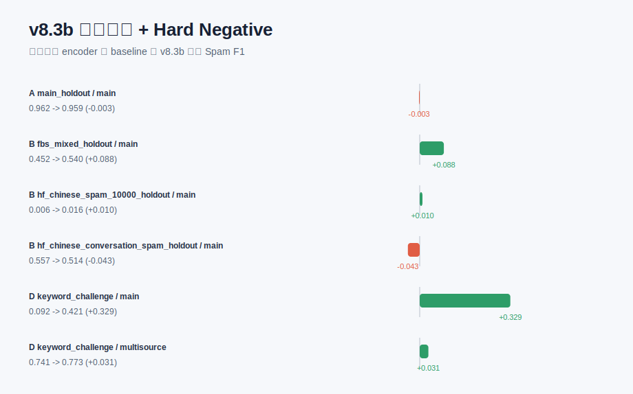

# v8.3b 增强样本筛选 + Hard Negative

本实验保留 v8.3a 的自动 hard positive 生成，但用原始语义模型分数过滤过易或过激进的增强样本，同时把高风险正常样本和其自动变体作为 hard negative 加回训练。目标是在保持 keyword challenge 收益的同时，减少 HF conversation 等跨域正常文本被误判为 spam 的副作用。当前正式默认参数为 `positive_min_score=0.05`、`positive_max_score=0.75`、`max_hard_negatives=200`。

## Baseline vs AutoAug

| protocol_id | dataset | scope | baseline_f1 | autoaug_f1 | f1_delta | baseline_recall | autoaug_recall | fn_delta |
| --- | --- | --- | --- | --- | --- | --- | --- | --- |
| A | main_holdout | main | 0.9619 | 0.9593 | -0.0026 | 0.9619 | 0.9570 | 3.0000 |
| A | main_holdout | multisource | 0.8716 | 0.8761 | 0.0045 | 0.9553 | 0.9487 | 4.0000 |
| B | fbs_mixed_holdout | main | 0.4524 | 0.5401 | 0.0877 | 0.2934 | 0.3714 | -273.0000 |
| B | hf_chinese_spam_10000_holdout | main | 0.0063 | 0.0162 | 0.0099 | 0.0032 | 0.0083 | -18.0000 |
| B | hf_chinese_conversation_spam_holdout | main | 0.5575 | 0.5144 | -0.0431 | 0.3895 | 0.3570 | 70.0000 |
| C | fbs_mixed_holdout | multisource | 0.9707 | 0.9706 | -0.0000 | 0.9643 | 0.9634 | 3.0000 |
| C | hf_chinese_spam_10000_holdout | multisource | 0.8465 | 0.8426 | -0.0039 | 0.8111 | 0.8139 | -10.0000 |
| C | hf_chinese_conversation_spam_holdout | multisource | 0.8998 | 0.8949 | -0.0048 | 0.9025 | 0.8997 | 6.0000 |
| D | keyword_challenge | main | 0.0919 | 0.4211 | 0.3292 | 0.0481 | 0.2667 | -59.0000 |
| D | keyword_challenge | multisource | 0.7413 | 0.7727 | 0.0315 | 0.5889 | 0.6296 | -11.0000 |

## 完整指标

| protocol_id | dataset | model_version | training_scope | threshold | accuracy | precision_spam | recall_spam | f1_spam | false_positive | false_negative |
| --- | --- | --- | --- | --- | --- | --- | --- | --- | --- | --- |
| A | main_holdout | v8_semantic_main | main_only | 0.7500 | 0.9923 | 0.9619 | 0.9619 | 0.9619 | 23.0000 | 23.0000 |
| A | main_holdout | v8_semantic_autoaug_filtered_main | main_only_autoaug_filtered | 0.7500 | 0.9918 | 0.9617 | 0.9570 | 0.9593 | 23.0000 | 26.0000 |
| A | main_holdout | v8_semantic_multisource | main_plus_external_adapt | 0.6500 | 0.9717 | 0.8014 | 0.9553 | 0.8716 | 143.0000 | 27.0000 |
| A | main_holdout | v8_semantic_autoaug_filtered_multisource | main_plus_external_adapt_autoaug_filtered | 0.6500 | 0.9730 | 0.8139 | 0.9487 | 0.8761 | 131.0000 | 31.0000 |
| B | fbs_mixed_holdout | v8_semantic_main | main_only | 0.7500 | 0.6449 | 0.9875 | 0.2934 | 0.4524 | 13.0000 | 2473.0000 |
| B | fbs_mixed_holdout | v8_semantic_autoaug_filtered_main | main_only_autoaug_filtered | 0.7500 | 0.6837 | 0.9893 | 0.3714 | 0.5401 | 14.0000 | 2200.0000 |
| C | fbs_mixed_holdout | v8_semantic_multisource | main_plus_external_adapt | 0.6500 | 0.9709 | 0.9771 | 0.9643 | 0.9707 | 79.0000 | 125.0000 |
| C | fbs_mixed_holdout | v8_semantic_autoaug_filtered_multisource | main_plus_external_adapt_autoaug_filtered | 0.6500 | 0.9709 | 0.9780 | 0.9634 | 0.9706 | 76.0000 | 128.0000 |
| B | hf_chinese_spam_10000_holdout | v8_semantic_main | main_only | 0.7500 | 0.4988 | 0.5000 | 0.0032 | 0.0063 | 11.0000 | 3477.0000 |
| B | hf_chinese_spam_10000_holdout | v8_semantic_autoaug_filtered_main | main_only_autoaug_filtered | 0.7500 | 0.4929 | 0.2929 | 0.0083 | 0.0162 | 70.0000 | 3459.0000 |
| C | hf_chinese_spam_10000_holdout | v8_semantic_multisource | main_plus_external_adapt | 0.6500 | 0.8526 | 0.8852 | 0.8111 | 0.8465 | 367.0000 | 659.0000 |
| C | hf_chinese_spam_10000_holdout | v8_semantic_autoaug_filtered_multisource | main_plus_external_adapt_autoaug_filtered | 0.6500 | 0.8475 | 0.8733 | 0.8139 | 0.8426 | 412.0000 | 649.0000 |
| B | hf_chinese_conversation_spam_holdout | v8_semantic_main | main_only | 0.7500 | 0.7539 | 0.9801 | 0.3895 | 0.5575 | 17.0000 | 1315.0000 |
| B | hf_chinese_conversation_spam_holdout | v8_semantic_autoaug_filtered_main | main_only_autoaug_filtered | 0.7500 | 0.7317 | 0.9199 | 0.3570 | 0.5144 | 67.0000 | 1385.0000 |
| C | hf_chinese_conversation_spam_holdout | v8_semantic_multisource | main_plus_external_adapt | 0.6500 | 0.9200 | 0.8971 | 0.9025 | 0.8998 | 223.0000 | 210.0000 |
| C | hf_chinese_conversation_spam_holdout | v8_semantic_autoaug_filtered_multisource | main_plus_external_adapt_autoaug_filtered | 0.6500 | 0.9159 | 0.8902 | 0.8997 | 0.8949 | 239.0000 | 216.0000 |
| D | adversarial | v8_semantic_main | main_only | 0.7500 | 1.0000 | 1.0000 | 1.0000 | 1.0000 | 0.0000 | 0.0000 |
| D | adversarial | v8_semantic_autoaug_filtered_main | main_only_autoaug_filtered | 0.7500 | 1.0000 | 1.0000 | 1.0000 | 1.0000 | 0.0000 | 0.0000 |
| D | adversarial | v8_semantic_multisource | main_plus_external_adapt | 0.6500 | 0.9924 | 1.0000 | 0.9924 | 0.9962 | 0.0000 | 1.0000 |
| D | adversarial | v8_semantic_autoaug_filtered_multisource | main_plus_external_adapt_autoaug_filtered | 0.6500 | 0.9771 | 1.0000 | 0.9771 | 0.9884 | 0.0000 | 3.0000 |
| D | keyword_challenge | v8_semantic_main | main_only | 0.7500 | 0.0481 | 1.0000 | 0.0481 | 0.0919 | 0.0000 | 257.0000 |
| D | keyword_challenge | v8_semantic_autoaug_filtered_main | main_only_autoaug_filtered | 0.7500 | 0.2667 | 1.0000 | 0.2667 | 0.4211 | 0.0000 | 198.0000 |
| D | keyword_challenge | v8_semantic_multisource | main_plus_external_adapt | 0.6500 | 0.5889 | 1.0000 | 0.5889 | 0.7413 | 0.0000 | 111.0000 |
| D | keyword_challenge | v8_semantic_autoaug_filtered_multisource | main_plus_external_adapt_autoaug_filtered | 0.6500 | 0.6296 | 1.0000 | 0.6296 | 0.7727 | 0.0000 | 100.0000 |

## 自动挖掘片段示例

| scope | term | spam_df | normal_df | hard_df | score | term_type |
| --- | --- | --- | --- | --- | --- | --- |
| main_fit | 优惠 | 171 | 1 | 21 | 563.1079 | positive |
| main_fit | 您好 | 147 | 2 | 36 | 382.4286 | positive |
| main_fit | 尊敬 | 64 | 0 | 8 | 347.5272 | positive |
| main_fit | 尊敬的 | 64 | 0 | 8 | 347.5272 | positive |
| main_fit | 敬的 | 64 | 0 | 8 | 347.5272 | positive |
| main_fit | x折 | 144 | 2 | 23 | 326.2257 | positive |
| main_fit | 新老 | 52 | 0 | 11 | 311.9162 | positive |
| main_fit | 三八 | 80 | 1 | 24 | 300.1804 | positive |
| main_fit | 女节 | 42 | 0 | 10 | 250.1284 | positive |
| main_fit | 送xx | 48 | 0 | 6 | 244.4473 | positive |
| main_fit | 好,我是 | 39 | 0 | 11 | 243.7732 | positive |
| main_fit | 满x | 76 | 1 | 15 | 241.9157 | positive |
| main_fit | 妇女节 | 40 | 0 | 10 | 239.8414 | positive |
| main_fit | 元宵 | 73 | 1 | 15 | 233.4091 | positive |
| main_fit | 满xx | 73 | 1 | 14 | 228.3442 | positive |
| main_fit | 询x | 30 | 0 | 13 | 215.6988 | positive |
| main_fit | 询xx | 30 | 0 | 13 | 215.6988 | positive |
| main_fit | 询xxx | 30 | 0 | 13 | 215.6988 | positive |
| main_fit | 满xxx | 68 | 1 | 14 | 214.3138 | positive |
| main_fit | 八节 | 36 | 0 | 9 | 210.5753 | positive |

## 自动生成样本示例

| scope | source_term | text | label | augmentation_type | base_score |
| --- | --- | --- | --- | --- | --- |
| main_fit | 优惠 | 优会 | 1 | filtered_positive | 0.6462 |
| main_fit | 优惠 | 优回 | 1 | filtered_positive | 0.4627 |
| main_fit | 优惠 | 游惠 | 1 | filtered_positive | 0.5121 |
| main_fit | 您好 | 您 好 | 1 | filtered_positive | 0.1491 |
| main_fit | 您好 | 您号 | 1 | filtered_positive | 0.3572 |
| main_fit | 您好 | 您好 | 1 | filtered_positive | 0.1491 |
| main_fit | 您好 | 您好好 | 1 | filtered_positive | 0.3118 |
| main_fit | 您好 | 您您好 | 1 | filtered_positive | 0.2354 |
| main_fit | 您好 | 您豪 | 1 | filtered_positive | 0.5098 |
| main_fit | 尊敬 | 尊 敬 | 1 | filtered_positive | 0.1602 |
| main_fit | 尊敬 | 尊京 | 1 | filtered_positive | 0.1294 |
| main_fit | 尊敬 | 尊尊敬 | 1 | filtered_positive | 0.1503 |
| main_fit | 尊敬 | 尊敬 | 1 | filtered_positive | 0.1602 |
| main_fit | 尊敬 | 尊敬敬 | 1 | filtered_positive | 0.2241 |
| main_fit | 尊敬 | 尊经 | 1 | filtered_positive | 0.1009 |
| main_fit | 尊敬 | 樽敬 | 1 | filtered_positive | 0.3083 |
| main_fit | 尊敬 | 遵敬 | 1 | filtered_positive | 0.1535 |
| main_fit | 尊敬的 | 尊 敬 的 | 1 | filtered_positive | 0.1775 |
| main_fit | 尊敬的 | 尊 敬的 | 1 | filtered_positive | 0.1775 |
| main_fit | 尊敬的 | 尊-敬的 | 1 | filtered_positive | 0.3712 |

## 结论口径

- 若 keyword challenge 提升且主数据不明显下降，说明自动 hard-case 增强有效。
- 若主数据或外部数据明显退化，需要降低 `--max-augmented` 或提高 `--min-spam-df`。
- 本实验仍不等价于人工 CSN 词表；所有片段来自训练 split 的统计挖掘。
