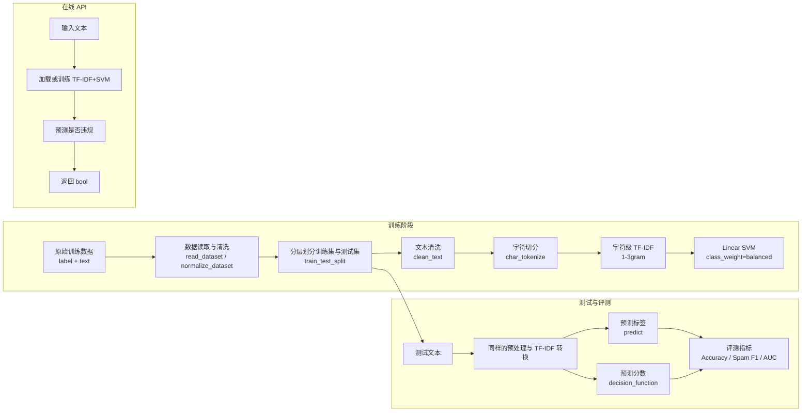
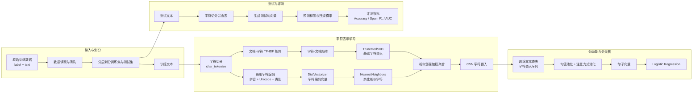

# 模型算法流程与架构说明

本文档根据 `src/` 中的当前代码整理，说明项目中两个传统机器学习模型的执行流程、核心原理和模型架构。

当前代码只保留两条路线：

| 模型 | 代码位置 | 核心方法 |
|---|---|---|
| TF-IDF+SVM | `src/tfidf_svm_baseline/experiment.py` | 字符级 TF-IDF 1-3gram + Linear SVM |
| Rule-free CSN+LR | `src/rule_free_csn/experiment.py` | 通用字符编码 + 字符相似性网络 + 句向量 + Logistic Regression |

## 共享实验流程

两个实验脚本都使用相同的监督学习评测框架：

1. 读取数据：`read_dataset()` 优先按 TSV 读取；如果格式不规整，则回退到 `read_loose_tsv()`。
2. 清理数据：`normalize_dataset()` 删除缺失样本，将 `label` 转为整数，将 `text` 转为字符串。
3. 划分数据：`train_test_split(test_size=0.3, random_state=42, stratify=label)`。
4. 训练模型：在训练集上拟合特征提取器和分类器。
5. 测试预测：在测试集上生成预测标签和预测分数。
6. 计算指标：Accuracy、Balanced Accuracy、Spam Precision、Spam Recall、Spam F1、Macro F1、Weighted F1、ROC-AUC、PR-AUC 和混淆矩阵四项。

## 模型一：TF-IDF+SVM

### 执行流程

TF-IDF+SVM 是当前项目的强 baseline，主要由 `build_model()` 构建。

1. `clean_text()` 进行文本清洗：
   - 统一小写；
   - 去除中文、英文、数字和空白之外的符号；
   - 合并连续空白。
2. `char_tokenize()` 进行分词：
   - 中文逐字切分；
   - 连续英文和数字合并为一个 token；
   - 空白用于分隔 token。
3. `preprocess()` 将 token 用空格拼接，供 `TfidfVectorizer` 使用。
4. `TfidfVectorizer` 提取字符级 `1-3gram` TF-IDF 特征。
5. `LinearSVC` 使用线性超平面对文本进行二分类。
6. `score_texts()` 调用 `decision_function()` 输出 SVM 距离分数，用于 AUC 类指标。

API 代码位于 `src/tfidf_svm_baseline/api.py`。`/predict` 接口默认使用 TF-IDF+SVM：如果 `TEXT_DETECTION_MODEL` 指定的模型文件存在，就直接加载；否则读取 `TEXT_DETECTION_DATA` 或默认 `data/raw/dataset.txt`，在全量数据上训练后返回布尔预测。

### 原理说明

该方法将文本表示为高维稀疏 n-gram 特征。字符级 n-gram 对中文垃圾文本中的局部模式很敏感，例如异常字符组合、联系方式片段、URL 结构、模板化表达等。Linear SVM 在这些稀疏特征上学习一个最大间隔分类边界，适合作为结构简单、效果强、可复现的传统机器学习 baseline。

该模型不使用人工敏感词表，也不写硬匹配规则；分类依据来自训练数据中的统计模式。

### 架构图



## 模型二：Rule-free CSN+LR

### 执行流程

Rule-free CSN+LR 位于 `src/rule_free_csn/experiment.py`，主体类是 `CourseStyleCSNClassifier`。它按课件中的字符相似性网络思路实现，但去除了人工敏感词表、人工变体词表和硬匹配规则。

1. 文本清洗与字符切分：
   - `clean_text()` 与 TF-IDF+SVM 类似；
   - `char_tokenize()` 将所有非空白字符逐字符保留。
2. 构建字符语料矩阵：
   - `texts_to_token_strings()` 将文本转为字符 token 序列；
   - `TfidfVectorizer(ngram_range=(1, 1))` 构造文档-字符 TF-IDF 矩阵；
   - 保存字符表 `characters_`、字符到下标映射 `char_to_index_` 和字符出现权重 `char_counts_`。
3. 学习基础字符嵌入：
   - `_learn_base_char_vectors()` 将文档-字符矩阵转置为字符-文档矩阵；
   - 使用 `TruncatedSVD` 得到低维字符嵌入；
   - 使用 `normalize()` 做向量归一化。
4. 构建通用字符编码：
   - `character_code_features()` 对字符生成非人工词表特征；
   - 中文字符使用 Unicode 分桶、Unicode block、拼音、声母、韵母和声调；
   - 数字、英文和其他字符使用通用类别特征。
5. 构建字符相似性网络：
   - `_build_code_vectors()` 使用 `DictVectorizer` 将字符编码转为稀疏向量；
   - `NearestNeighbors(metric="cosine")` 查找相似字符；
   - 保留相似度不低于 `similarity_threshold=0.52` 的邻居。
6. 生成 CSN 字符嵌入：
   - `_build_csn_vectors()` 用相似字符邻居对基础字符嵌入做加权聚合；
   - 权重由字符出现权重和字符相似度共同决定；
   - 得到归一化后的 CSN 字符向量。
7. 生成句子向量：
   - `_sentence_vector()` 最多取前 `max_chars=120` 个字符；
   - 查表获得 CSN 字符嵌入；
   - 计算均值向量；
   - 用字符向量与均值向量的相似度生成注意力权重；
   - 将均值池化和注意力池化各占一半，得到最终句向量。
8. 分类：
   - 使用 `LogisticRegression(class_weight="balanced")` 对句向量进行二分类；
   - `predict_proba()` 输出违规概率，用于 AUC 类指标。

### 原理说明

该方法的目标是模拟“字形/字音相似字符可能表达相近规避意图”的思想。模型先为每个字符构造通用编码，再基于编码相似度建立字符相似性网络。随后，模型用语料分布学到的基础字符嵌入表示字符语义，再通过相似字符邻居做加权传播，得到 CSN 字符嵌入。

文本分类时，句子不再直接使用高维 n-gram 模板特征，而是被压缩为一个低维句向量。最后使用逻辑回归完成分类。这个流程更接近课件中的字符相似性网络思路，但由于没有显式记忆长 URL、电话号码、固定模板等稀疏片段，它通常不如 TF-IDF+SVM 强。

该模型的“Rule-free”含义是：字符相似性由拼音、Unicode 和语料统计自动推断，不使用人工敏感词、人工变体词或垃圾文本规则。

### 架构图



## 两个模型的主要区别

| 维度 | TF-IDF+SVM | Rule-free CSN+LR |
|---|---|---|
| 文本表示 | 高维稀疏字符 n-gram | 低维句子嵌入 |
| 核心特征 | 训练语料中的局部统计片段 | 字符相似网络传播后的字符向量 |
| 分类器 | Linear SVM | Logistic Regression |
| 是否使用人工词表 | 否 | 否 |
| 对模板型垃圾文本 | 更强 | 较弱 |
| 对课件 CSN 思路的贴合度 | 低，属于强 baseline | 高，属于课程方法实现 |
| API 默认模型 | 是 | 否 |

## 运行入口

```bash
python -m src.tfidf_svm_baseline.experiment --data data/raw/dataset.txt
python -m src.rule_free_csn.experiment --data data/raw/dataset.txt
python -m uvicorn src.tfidf_svm_baseline.api:app --host 127.0.0.1 --port 8000
```
