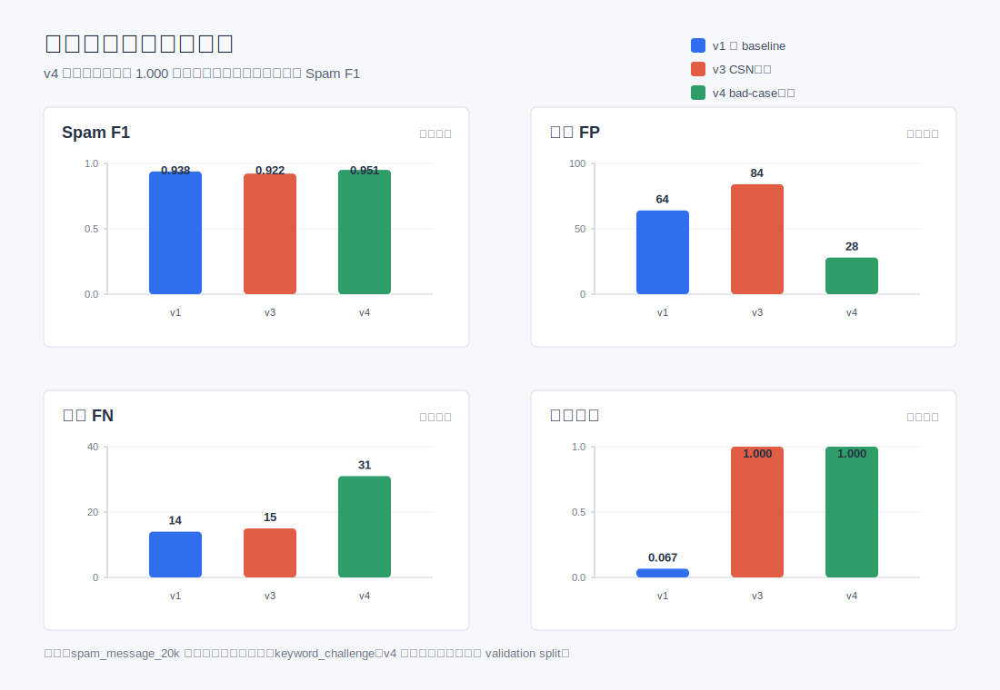

# 实验结果报告摘要

## 优化主线

本项目先建立 `字符级 TF-IDF + Linear SVM` 强 baseline，再引入字符相似性网络（CSN）处理字形、字音变体，然后根据 bad case 分析加入风险分数和阈值调优。主数据集最终采用 v5 分数融合方案；跨来源泛化实验进一步加入 v6/v7 多来源适配方案。

## 核心结论

- v1 强 baseline 在普通测试集上 Spam F1 为 `0.9380`，但 keyword challenge 对抗召回只有 `0.0667`。
- v3 CSN + 关键词增强把对抗召回提升到 `1.0000`，但误杀从 `64` 增加到 `84`。
- v4 bad-case 调优保持对抗召回 `1.0000`，同时把误杀降到 `28`，Spam F1 提升到 `0.9510`。
- v5 max-score fusion 在主测试集上把 Spam F1 提升到 `0.9587`，漏检从 `31` 降到 `23`，适合作为主数据集上的最终版本。
- 新增 HF 数据集后，跨来源结论更谨慎：v3 在两个 HF 外部集上优于 v5，说明 v4/v5 的高阈值策略会牺牲外部数据召回。
- v6 跨来源适配使用 30% 外部数据参与训练后，外部 holdout 泛化显著提升：FBS Spam F1 `0.9833`，HF chinese-spam-10000 Spam F1 `0.8876`，HF conversation-spam Spam F1 `0.9489`。
- v7 桥接方案在 v5 主数据模型和 v6 多来源模型之间折中，主测试集 Spam F1 为 `0.9466`，外部集仍明显优于 main-only 模型。
- 当前已固定 A/B/C/D 四类统一评测协议，后续 v8 语义编码模型必须在相同协议下与 v5/v6/v7 对比。
- v8.0 语义编码第一版已跑通：主测试集 Spam F1 达到 `0.9619`，略高于 v5；但 keyword challenge Recall 最高只有 `0.5889`，外部 zero-shot 漏检明显，因此暂时作为新架构 baseline，不替换 v5/v6/v7。
- v8.1 诊断显示：FBS zero-shot 的 PR-AUC 为 `0.9627`，主要是阈值过保守；HF chinese-spam zero-shot 的 PR-AUC 只有 `0.4950`，oracle 阈值退化，说明语义表示本身分不开。
- v8.2 对比三个 encoder 后发现：`bge_small_zh` 仍是最稳默认选择，主数据集 Spam F1 `0.9619`；`multilingual_minilm` 在 FBS zero-shot 上最好，Spam F1 `0.8518`；`m3e_small` 在 HF chinese-spam few-shot 上略优，Spam F1 `0.8513`。
- v8.3a 轻量自动增强把 keyword challenge main-only Spam F1 从 `0.0919` 提升到 `0.4393`，multisource 从 `0.7413` 提升到 `0.7586`；但 HF conversation zero-shot 下降明显，因此不能直接作为最终模型。
- v8.3b 加入增强样本筛选和 hard negative 后，FBS zero-shot main-only Spam F1 提升到 `0.5401`，keyword challenge main-only Spam F1 保持在 `0.4211`；HF conversation zero-shot 从 v8.3a 的 `0.4767` 回升到 `0.5144`，但仍低于 v8.0 baseline 的 `0.5575`。

## 可展示指标

| 方法 | Spam F1 | Precision | Recall | FP | FN | 对抗召回 |
|---|---:|---:|---:|---:|---:|---:|
| v1 强 baseline | 0.9380 | 0.9021 | 0.9768 | 64 | 14 | 0.0667 |
| v3 CSN增强 | 0.9225 | 0.8752 | 0.9752 | 84 | 15 | 1.0000 |
| v4 bad-case调优 | 0.9510 | 0.9534 | 0.9487 | 28 | 31 | 1.0000 |
| v5 分数融合 | 0.9587 | 0.9556 | 0.9619 | 27 | 23 | 1.0000 |

## 报告表述建议

v1 说明字符级建模对中文短文本有效；v3 说明字符相似性网络能解决对抗变体；v4 说明通过 bad-case 分析和阈值调优，可以在鲁棒性和误杀控制之间取得更好的平衡；v5 说明融合普通强基线与 CSN 模型分数后，可以减少漏检并保持对抗鲁棒性。

补充说明：跨来源数据上仍存在明显漏检。FBS 上 v1/v3 的 Spam F1 约 `0.908`，高于 v5 的 `0.8117`；HF `chinese-spam-10000` 上所有版本召回都很低，最好的 v3 Recall 也只有 `0.0881`。后续优化应重点做跨来源召回，而不是继续只在主测试集上微调阈值。

最新适配实验说明：如果允许使用外部标注数据训练，v6 可以大幅提升跨来源泛化；但它会牺牲主数据集上的精度和 F1。因此最终报告可以采用“双结论”：主数据集最终模型为 v5，跨来源适配方案为 v6/v7。

统一评测协议说明：Protocol A 用于选择主数据集模型，旧版 v0-v7 中 v5 最优；Protocol B 暴露 main-only 模型 zero-shot 泛化不足；Protocol C 证明少量外部标注适配可以明显提升跨来源表现；Protocol D 用于展示对抗鲁棒性。

v8.0 补充说明：如果报告想展示“去人工规则、纯模型推断”的探索，可以把 v8.0 放在拓展实验中。它说明语义编码器能提升主数据集上限，但第一版还不能稳定覆盖短关键词变体，后续需要编码器对比、微调或 hard-case 数据增强。

v8.1 补充说明：诊断结果把问题拆开了。FBS 和 conversation 数据集可以优先尝试校准；`hf_chinese_spam_10000` 需要优先换编码器或做监督适配；keyword challenge 需要自动 hard-case 增强。

v8.2 补充说明：单纯换 encoder 不能全面解决问题。报告中可以把它作为消融实验，说明 BGE 是当前默认语义编码器，但特定外部数据集存在 encoder 偏好，后续应考虑 ensemble、自动增强或微调。

v8.3a 补充说明：自动 hard-case 增强证明“不写人工词表”也能提升短关键词鲁棒性，但增强样本会改变分类边界。下一步需要加入 hard negative 或增强样本筛选，控制跨域退化。

v8.3b 补充说明：增强样本筛选和 hard negative 能缓解 v8.3a 的跨域副作用，说明自动增强路线是可行的；但它还没有完全解决 main-only 跨域泛化，报告中应把 v8.3b 定位为语义模型探索阶段的改进版，而不是替代 v5/v6/v7 的最终方案。
